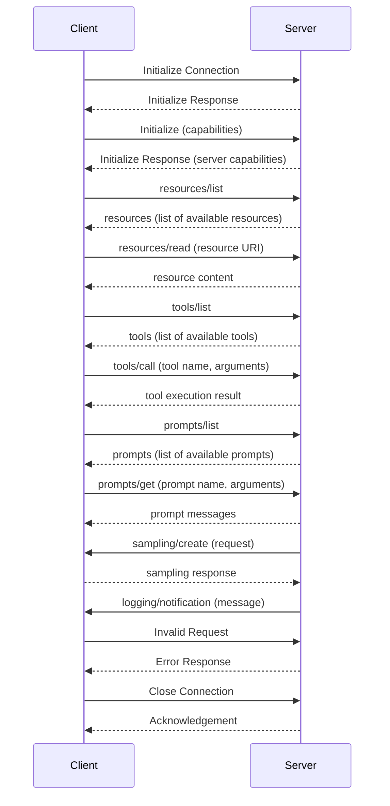

### MCP sequence

```mermaid
sequenceDiagram
    participant Client
    participant Server
    
    %% Connection Establishment
    Client->>Server: Initialize Connection
    Server-->>Client: Initialize Response
    
    %% Capability Negotiation
    Client->>Server: Initialize (capabilities)
    Server-->>Client: Initialize Response (server capabilities)
    
    %% Resource Operations
    Client->>Server: resources/list
    Server-->>Client: resources (list of available resources)
    
    Client->>Server: resources/read (resource URI)
    Server-->>Client: resource content
    
    %% Tool Operations
    Client->>Server: tools/list
    Server-->>Client: tools (list of available tools)
    
    Client->>Server: tools/call (tool name, arguments)
    Server-->>Client: tool execution result
    
    %% Prompt Operations
    Client->>Server: prompts/list
    Server-->>Client: prompts (list of available prompts)
    
    Client->>Server: prompts/get (prompt name, arguments)
    Server-->>Client: prompt messages
    
    %% Sampling Operations
    Server->>Client: sampling/create (request)
    Client-->>Server: sampling response
    
    %% Logging
    Server->>Client: logging/notification (message)
    
    %% Error Handling
    Client->>Server: Invalid Request
    Server-->>Client: Error Response
    
    %% Connection Termination
    Client->>Server: Close Connection
    Server-->>Client: Acknowledgement
```

    https://modelcontextprotocol.io/specification/2025-03-26